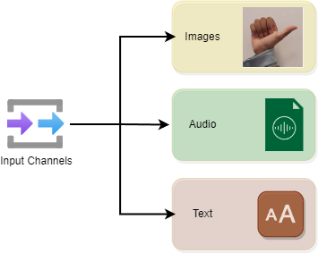
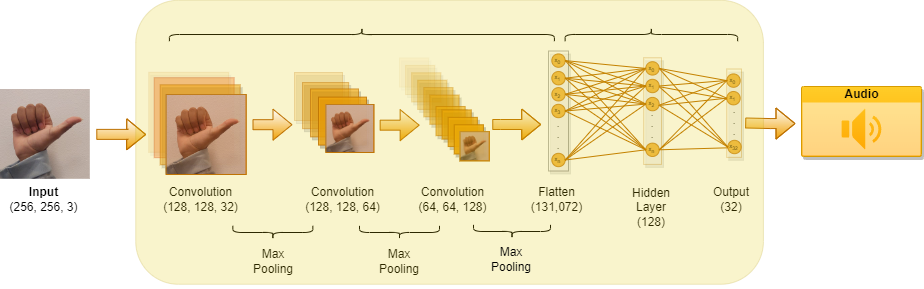

# Hear Me in Silence: Multilingual Sign Language Vision-Based Translation

This is a project that aims to develop a system capable of translating sign language into multiple spoken languages and vice versa, using computer vision and artificial intelligence techniques. This project seeks to bridge communication gaps between deaf and hearing communities by providing an accessible, efficient, and accurate translation tool that can understand and produce sign language in real-time.

This project can take input in 3 different form.  

<h5>Images Input</h5>
<ul>
<li> The system captures a series of images using a camera. These images are of individuals performing sign language gestures.
<li> The images are pre-processed to improve the quality for better recognition. This step may include resizing, normalization, and potentially augmenting the data to improve the robustness of the model against variations in background, lighting, and the signer's position.
<li> A Convolutional Neural Networks (CNN) are utilized for feature extraction from the pre-processed images. CNNs are highly effective in recognizing visual patterns with spatial hierarchies by learning from large datasets of sign language gestures. The model analyzes the series of images to detect and interpret the sign language gestures.
<li> The features extracted by the CNN are passed to a fully connected layer, which interprets the gestures as corresponding sign language tokens (letters). These tokens are then translated into the target spoken language text. This step involoves the usuage of an API.
<li> The translated text is finally converted into audio using Text-to-Speech technology. This allows hearing users to understand the content of the sign language communication. The TTS system used was a python library called gTTs.
</ul>

<h5>Audio Input</h5>
<ul>
<li> The system starts by capturing audio input, which could be spoken words or sentences from a user. This input is then processed to remove noise and enhance clarity for more accurate recognition.
<li> The cleaned audio data is fed into a speech recognition engine, which converts the spoken language into text. This step involves using advanced algorithms and models trained on diverse datasets to accurately transcribe spoken words across different languages and accents.
<li> The text obtained from the speech recognition is then translated into sign language tokens.
<li>  Once the sign language tokens are determined, the system generates a visual representation of the sign language.
<li> The generated sign language images are presented to the user through a display. This visual output allows deaf or hard-of-hearing individuals to understand the spoken language content through sign language.
</ul>

<h5>Text Input</h5>
<ul>
<li> The process begins with the user inputting text, which could be in the form of sentences, phrases, or words. This text represents the message that needs to be translated into sign language.
<li> The entered text is analyzed and translated into sign language tokens.
<li> Once the sign language equivalent of the text is determined, the system generates a visual representation of the sign language.
<li>  The visual representation of the sign language is displayed to the user. This enables individuals who understand sign language to receive the message conveyed by the text input.
</ul>

The successful implementation of this project could significantly enhance communication access for the deaf and hard-of-hearing communities, fostering more inclusive societies. Achieving this goal requires interdisciplinary collaboration among computer scientists, linguists, sign language experts, and community stakeholders.
